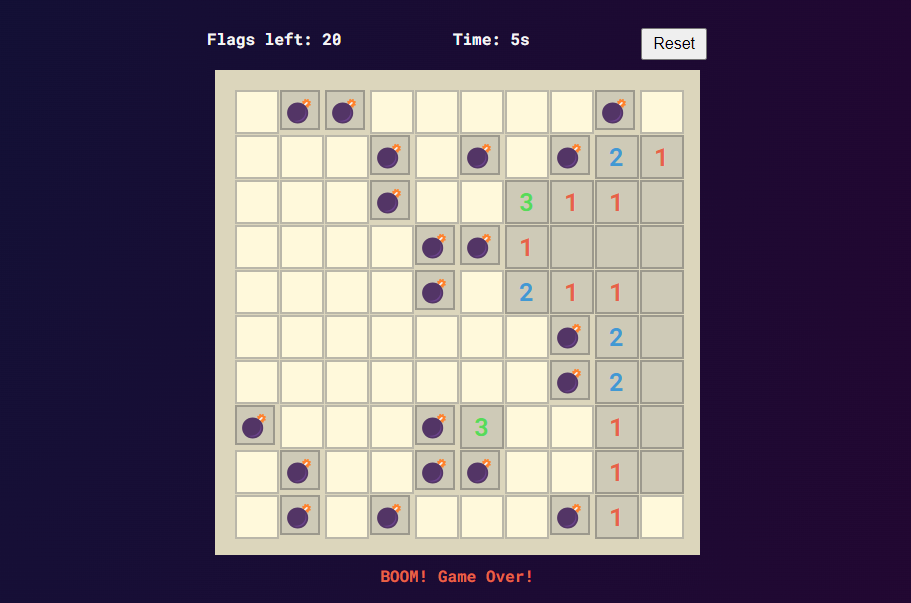

# Minesweeper w/ ReactJS

Minesweeper is a classic single-player puzzle game where the player must clear a grid containing hidden mines without detonating any of them. This project implements Minesweeper using React and Vite, providing an interactive and enjoyable gaming experience.



## Features

- Interactive grid-based gameplay.
- Timer to track the duration of the game.
- Flags counter to keep track of the remaining flags.
- Reset button to start a new game.
- Responsive design for various screen sizes.

## How to Play

1. Click on a square to reveal its content.
2. Numbers indicate how many mines are adjacent to the clicked square.
3. Right-click to place a flag on a square suspected to contain a mine.
4. The game is won when all non-mine squares are revealed and flagged correctly.
5. The game is lost if a mine square is revealed.

## Installation

1. Clone this repository to your local machine:

   ```bash
   git clone https://github.com/your-username/minesweeper-react.git
   ```

2. Navigate to the project directory:

   ```bash
   cd minesweeper-react
   ```

3. Install dependencies using npm or yarn:

   ```bash
   npm install
   # or
   yarn install
   ```

4. Start the development server:

   ```bash
   npm run dev
   # or
   yarn dev
   ```

5. Open your browser and visit [http://localhost:3000](http://localhost:3000) to play the game.

## Demon

Play the live demo [here](https://arindal1.github.io/minesweeper-ReactJS/).

## License

This project is licensed under the MIT License. See the [LICENSE](LICENSE) file for more details.

## Contact

- [Twitter](https://twitter.com/arindal_17)
- [GitHub](https://github.com/arindal1)
- [LinkedIn](https://www.linkedin.com/in/arindalchar)

## Keep Coding 🚀
